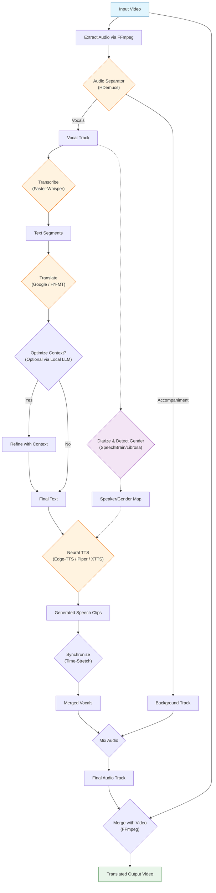

# AI Video Translator (Local)

An advanced, locally-run video translation pipeline that separates vocals, transcribes speech, translates text, generates new speech, and synchronizes it back to the video while preserving the original background audio and video quality.

## 🚀 Key Features

*   **Vocal Separation**: Uses **HDemucs** (Meta's Hybrid Demucs) to cleanly separate speech from background music/sfx. Optimized with chunking to handle long videos on limited GPU memory.
*   **Precision Transcription**: Powered by **Faster-Whisper** (CTranslate2). Selectable models (Large v3, Medium, Base) for balancing speed vs accuracy.
*   **Multi-Language Translation**: 
    *   **Google Translate** (Online): Fast, reliable standard translation.
    *   **Tencent HY-MT1.5** (Local): Large language model (1.8B) for better context and consistency in translations.
*   **Neural TTS**: 
    *   **Edge-TTS** (Online): High-quality, natural-sounding speech generation.
    *   **Piper TTS** (Local): Robust offline neural TTS using the official Piper binary (automatically downloaded).
    *   **XTTS-v2** (Local): High-fidelity voice cloning using Coqui TTS. Requires ~2GB VRAM.
*   **Smart Synchronization**: Automatically stretches or squeezes generated speech to match the original timing.
*   **Speaker Diarization**: Optionally detects multiple speakers using **SpeechBrain's ECAPA-TDNN** embeddings with spectral clustering, and assigns gender-appropriate TTS voices (Male/Female) based on pitch analysis.
*   **GPU Optimized**: Custom memory management includes aggressive model offloading and audio chunking to prevent CUDA Out-of-Memory errors.
*   **Friendly UI**: Easy-to-use **Gradio** web interface.

## 🛠️ Prerequisites

*   **Python 3.10+**
*   **FFmpeg**: Must be installed and accessible in your system's PATH.
    *   *Windows*: `winget install ffmpeg` or download from [ffmpeg.org](https://ffmpeg.org/).
*   **NVIDIA GPU** (Recommended): For faster HDemucs and Whisper inference. CPU is supported but slower.

## 📦 Installation

1.  **Clone the repository** (or extract files):
    ```bash
    cd video-translator
    ```

2.  **Install Dependencies**:
    It is recommended to use a virtual environment (Python 3.10 recommended for XTTS):
    ```bash
    py -3.10 -m venv venv
    .\venv\Scripts\activate
    pip install -r requirements.txt
    ```

3.  **Additional Requirements**:
    If not already installed via requirements, ensure you have:
    ```bash
    pip install torch torchaudio --index-url https://download.pytorch.org/whl/cu118  # Adjust for your CUDA version
    pip install openai-whisper deep-translator edge-tts gradio soundfile ffmpeg-python faster-whisper onnxruntime transformers accelerate
    ```

## 🖥️ Usage

1.  **Run the Application**:
    ```bash
    .\venv\Scripts\python app.py
    ```

2.  **Open Interface**:
    Click the local URL provided in the console (usually `http://127.0.0.1:7860`).

3.  **Translate a Video**:
    *   **Upload Video**: Select an MP4/MKV/MOV file.
    *   **Select Source Language**: (Optional) Specify the original language to improve transcription accuracy.
    *   **Select Speech-to-Text Model**: 
        *   `Large v3`: Best accuracy (Recommended).
        *   `Medium/Base`: Faster, less accurate.
    *   **Select Target Language**: Choose from the dropdown (e.g., Spanish, Japanese).
    *   **Select Target Language**: Choose from the dropdown (e.g., Spanish, Japanese).
    *   **Select Translation Model**: 
        *   `Google Translate`: Default, fast.
        *   `Tencent HY-MT1.5`: Local LLM, better context (downloads ~3.5GB on first run).
    *   **Optimize Context** (Optional): Check this box to enable a second pass where a local AI reviews each segment against its neighbors to improve flow and context.
    *   **Select TTS Model**: 
        *   `edge`: Online, highest quality (requires internet).
        *   `piper`: Local, fast, private.
        *   `xtts`: Local voice cloning (uses input video's vocals as reference).
    *   **Enable Speaker Diarization**: Check this to automatically detect speakers and use different voices (Male/Female) for each.
    *   **Click Submit**: The progress bar will track the stages (Separating -> Transcribing -> Translating -> Synthesizing -> Mixing).

4.  **Output**:
    The translated video will appear in the output component for download/playback. Files are saved to `output/`.

## ⚙️ Configuration

*   **Directory Structure**:
    *   `temp/`: Stores intermediate files (vocals, separated tracks). Cleared/Managed during runs.
    *   `output/`: Stores final processed videos.
*   **Env Variables** (Optional):
    *   `HF_TOKEN`: HuggingFace token. Required for some models that need authentication.

## 🧩 Pipeline Architecture




1.  **Extract**: FFmpeg extracts audio from input video.
2.  **Separate**: HDemucs splits audio into `vocals` and `accompaniment`.
3.  **Transcribe**: Whisper converts `vocals` to text segments with start/end times.
4.  **Diarize (Optional)**: SpeechBrain ECAPA-TDNN extracts speaker embeddings, spectral clustering groups them, and librosa pitch analysis detects genders.
5.  **Translate**: Segments are translated text-to-text.
6.  **Synthesize (TTS)**: Edge-TTS generates speech for each translated segment, matching speaker gender if enabled.
7.  **Synchronize**: generated clips are time-stretched to fit original segment duration.
8.  **Mix**: New vocals are mixed with original `accompaniment`.
9.  **Merge**: Final mix is replaced into the original video container.

## 🔧 Troubleshooting

*   **"TorchCodec is required"**: This project uses `soundfile` backend to avoid this error. If you see it, ensure `soundfile` is installed.
*   **CUDA Out of Memory**: The system uses chunking (10s segments) for separation. If you still OOM, try closing other GPU-heavy apps.
*   **Video not playing in browser**: Gradio/Browser compatibility. Use VLC or Media Player for the downloaded file.
