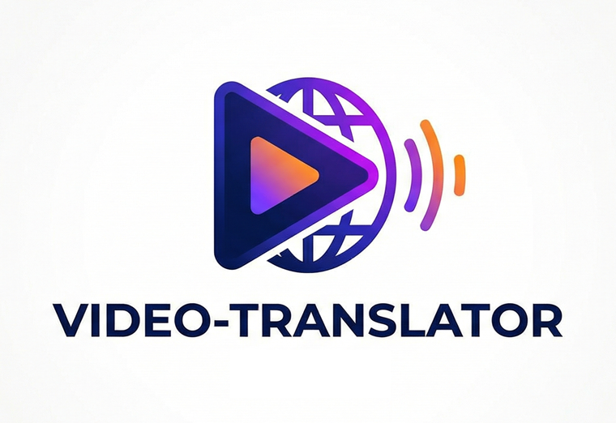
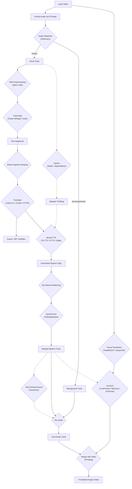

# 🌍 AI Video Translator (Local)

> **Break language barriers with cinema-quality video translation — privately, on your own hardware.**

Transform any video into a professional multilingual production with natural voice cloning, lip-sync, and on-screen text translation. No cloud APIs, no subscriptions, no data leaving your machine.

---

## ✨ Why This Project?

**Traditional dubbing** is expensive, time-consuming, and requires professional studios. **AI Video Translator** democratizes video localization by bringing Hollywood-grade technology to your desktop:

- 🎬 **Content Creators**: Expand your audience globally without hiring voice actors
- 🎓 **Educators**: Make training content accessible in any language
- 📰 **Journalists & Documentarians**: Localize footage for international audiences
- 🎮 **Game Developers**: Dub cutscenes and trailers cost-effectively
- 🏢 **Businesses**: Translate corporate videos, presentations, and webinars
- 🔒 **Privacy-Focused Users**: Keep sensitive content 100% local

---

## 🎯 What It Does

Upload a video, select your target language, and let the AI handle everything:

```
📹 Input Video (English) → 🤖 AI Pipeline → 📹 Output Video (French, with cloned voice & synced lips)
```

**The full pipeline includes:**
1. **Vocal Separation** — Isolates speech from music/sound effects
2. **Transcription** — Converts speech to text with word-level precision
3. **Translation** — Translates text using local LLMs or Google Translate
4. **Voice Cloning** — Regenerates speech in the target language with the original speaker's voice
5. **Lip-Sync** — Adjusts mouth movements to match the new audio
6. **Visual Text Translation** — Detects and replaces on-screen text (subtitles, signs, etc.)
7. **Audio Enhancement** — Cleans and restores generated speech for broadcast quality

---

## 🚀 Key Features

### Audio Intelligence
| Feature | Technology | Description |
|---------|------------|-------------|
| **Vocal Separation** | HDemucs (Meta) | Cleanly separates speech from background music/sfx with GPU chunking for long videos |
| **Transcription** | Faster-Whisper (Large v3 Turbo) | 30-50% faster with Silero VAD preprocessing and word-level confidence filtering |
| **Speaker Diarization** | NeMo MSDD / SpeechBrain | Identifies individual speakers for multi-voice dubbing |
| **EQ Spectral Matching** | Custom | Applies original voice tonal characteristics to TTS output |
| **Voice Enhancement** | VoiceFixer | Restores degraded speech and removes noise (optional) |

### Translation Engine
| Model | Type | Best For |
|-------|------|----------|
| **Google Translate** | Online | Fast, reliable everyday translation |
| **Tencent HY-MT1.5** | Local (1.8B) | Better context preservation |
| **Llama 3.1 8B Instruct** | Local | Nuanced, human-like translations |
| **ALMA-R 7B** | Local | State-of-the-art translation quality |

All local models support **context-aware mode** using full-transcript context for superior coherence.

### Voice Synthesis (TTS)
| Model | Type | Highlights |
|-------|------|------------|
| **Edge-TTS** | Online | Natural Microsoft voices, zero GPU needed |
| **Piper TTS** | Local | Robust offline neural TTS (auto-downloaded) |
| **XTTS-v2** | Local | High-fidelity voice cloning with emotion control (Happy, Sad, Angry) |
| **F5-TTS** | Local | Ultra-fast zero-shot voice cloning with Sway Sampling |
| **VibeVoice** | Local | Microsoft's frontier long-form multi-speaker TTS (1.5B/7B) |

### Visual Enhancements
| Feature | Technology | Description |
|---------|------------|-------------|
| **Lip-Sync (Fast)** | Wav2Lip-GAN | Smooth, blended lip synchronization |
| **Lip-Sync (HD)** | Wav2Lip + GFPGAN | Face restoration eliminates blurriness |
| **Lip-Sync (Cinema)** | LivePortrait | State-of-the-art cinematic lip sync with natural facial animation |
| **Visual Text Translation** | PaddleOCR / EasyOCR | Detects and replaces on-screen text with OpenCV inpainting |

### Production-Ready
- 🖥️ **Friendly Gradio UI** — Easy drag-and-drop interface
- 🎛️ **Fine-Grained Control** — Beam size, VAD settings, voice selection, and more
- 👤 **LivePortrait Lip-Sync** — State-of-the-art lip synchronizer with TensorRT acceleration support
- 🖼️ **Visual Text Translation** — Detects, translates, and seamlessly replaces text in video frames (cached for speed)
- 📝 **Auto-Generated Subtitles** — Exports `.srt` files alongside translated videos
- 🔄 **Smart Segment Merging** — Combines choppy phrases into natural sentences
- ⏳ **Real-time Progress & ETA** — Track detailed progress with estimated time remaining
- 🧹 **VoiceFixer Enhancement** — Restores and cleans up generated audio for studio quality
- ⚡ **GPU Optimized** — One-model-at-a-time policy for maximum VRAM efficiency
- 🛡️ **Global CPU Fallback** — Automatically switches to CPU if GPU fails

---

## 🎬 Use Cases

### 🎥 YouTube & Social Media Creators
> "I have 50 English tutorials and want to reach Spanish speakers."

Upload each video, select English → Spanish, and export professional dubs with your cloned voice. No re-recording needed!

### 🎓 Corporate Training & E-Learning
> "Our compliance training is in English but we have offices in 12 countries."

Batch-translate training videos while maintaining the presenter's voice for authenticity. Export with or without subtitles.

### 🎞️ Film & Documentary Localization
> "I want my indie film to premiere at international festivals."

Use LivePortrait (HD) lip-sync for cinema-quality dubbing that doesn't look like a bad overdub.

[LivePortrait GPU Acceleration](LivePortrait%20GPU%20Acceleration.md)

### 📢 Marketing & Advertising
> "We need our 30-second ad in French, German, and Japanese by tomorrow."

Process multiple language versions simultaneously with local LLM translation for brand-appropriate messaging.

### 🔐 Sensitive Content Translation
> "Our video contains confidential product demos."

Everything runs locally — no data leaves your machine. Perfect for legal teams, medical content, or proprietary information.

---

## 🛠️ Prerequisites

| Requirement | Details |
|-------------|---------|
| **Python** | 3.10+ (3.10 recommended) |
| **PyTorch** | 2.5.1+ with CUDA 12.4+ |
| **GPU** | NVIDIA GPU recommended (RTX 30/40/50 series supported) |
| **VRAM** | 8GB minimum, 12GB+ recommended for HD lip-sync |
| **FFmpeg** | Must be in system PATH |
| **Rubberband** | Recommended for high-quality audio time-stretching |

<details>
<summary><strong>📥 FFmpeg Installation</strong></summary>

**Windows (Option 1):**
```powershell
winget install ffmpeg
# Restart terminal after installation
```

**Windows (Option 2 - Manual):**
1. Download from [ffmpeg.org/download](https://ffmpeg.org/download.html) (Windows builds → gyan.dev)
2. Extract to `C:\ffmpeg`
3. Add `C:\ffmpeg\bin` to your system PATH
4. Restart terminal and verify: `ffmpeg -version`

**Linux:**
```bash
sudo apt install ffmpeg
```

**macOS:**
```bash
brew install ffmpeg
```
</details>

<details>
<summary><strong>📥 Rubberband Installation</strong></summary>

Download from [Rubberband Releases](https://breakfastquay.com/rubberband/). Extract and add to PATH, or place `rubberband-program.exe` in the project folder.
</details>

---

## 📦 Installation

```bash
# Clone the repository
git clone https://github.com/overcrash66/video-translator.git
cd video-translator

# Create virtual environment (Python 3.10 recommended)
py -3.10 -m venv venv
.\venv\Scripts\activate  # Windows
# source venv/bin/activate  # Linux/macOS

# Install dependencies
pip install -r requirements.txt
```

### Optional Components

| Feature | Requirement |
|---------|-------------|
| **NeMo Diarization** | `nemo_toolkit[asr]` |
| **Wav2Lip** | Model file at `models/wav2lip/wav2lip_gan.pth` |
| **F5-TTS** | `f5-tts` package (GPU recommended) |
| **Enhanced Lip-Sync** | `gfpgan` and `basicsr` (included in requirements) |
| **LivePortrait** | ~2GB VRAM, auto-downloads to `models/live_portrait` |
| **Llama 3.1 / NeMo** | HuggingFace token (`HF_TOKEN` env variable) |

---

## 🖥️ Usage

### Quick Start

```bash
# Activate environment
.\venv\Scripts\activate

# Launch the application
python app.py
```

Open your browser to `http://127.0.0.1:7860`

### Step-by-Step Translation

1. **Upload Video** — Drag & drop MP4, MKV, or MOV files
2. **Select Languages** — Source (or Auto-detect) → Target
3. **Choose Models:**
   - **Translation**: Google (fast) / Llama 3.1 (quality) / ALMA-R (best)
   - **TTS**: Edge (online) / F5-TTS (fast cloning) / XTTS (emotion control)
4. **Enable Features** (optional):
   - ✅ Speaker Diarization — Multi-speaker videos
   - ✅ Lip-Sync — Select quality level (Fast/HD/Cinema)
   - ✅ Visual Text Translation — Replace on-screen text
   - ✅ Audio Enhancement — VoiceFixer post-processing
5. **Click "Process Video"** and monitor progress

---

## ⚙️ Configuration

### Directory Structure
```
video-translator/
├── temp/           # Intermediate files (auto-cleaned)
├── output/         # Final translated videos
├── models/         # Downloaded model weights
└── .env            # Environment variables (HF_TOKEN, etc.)
```

### Environment Variables
```env
HF_TOKEN=your_huggingface_token  # Required for Llama 3.1, NeMo
```

---

## 🧩 Pipeline Architecture



---

## 🤝 Contributing

Contributions are welcome! Areas where help is appreciated:
- Additional language support and voice models
- Performance optimizations
- Bug fixes and stability improvements
- Documentation and tutorials

---

## 📄 License

This project is for educational and personal use. Please respect the licenses of underlying models and technologies.

---

<div align="center">

**🌟 Star this repo if you find it useful! 🌟**

*Made with ❤️ for content creators worldwide*

</div>
