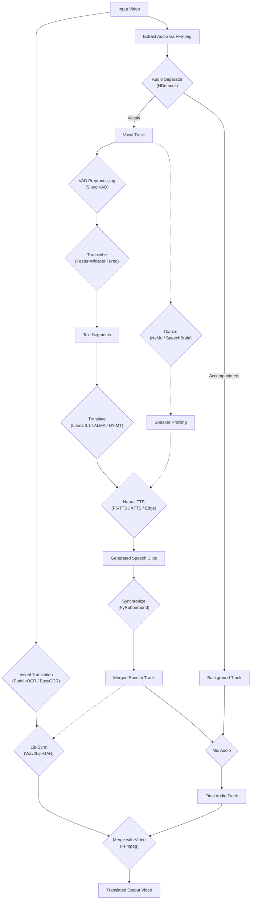

# AI Video Translator (Local)

An advanced, locally-run video translation pipeline that separates vocals, transcribes speech, translates text, generates new speech, and synchronizes it back to the video while preserving the original background audio and video quality.

## 🚀 Key Features

*   **Vocal Separation**: Uses **HDemucs** (Meta's Hybrid Demucs) to cleanly separate speech from background music/sfx. Optimized with chunking to handle long videos on limited GPU memory.
*   **Precision Transcription**: Powered by **Faster-Whisper** (CTranslate2). 
    *   **Whisper Large v3 Turbo** (Recommended): 30-50% faster with comparable accuracy.
    *   **Silero VAD Preprocessing**: Filters non-speech regions to reduce hallucinations. Fully configurable (Min Silence, Speech Pad) and toggleable.
    *   **Beam Size Tuning**: Adjustable beam size (1-5) for balancing transcription speed vs accuracy.
    *   **Word-level Confidence Filtering**: Removes low-confidence transcriptions.
*   **Multi-Language Translation**: 
    *   **Google Translate** (Online): Fast, reliable standard translation.
    *   **Tencent HY-MT1.5** (Local): Large language model (1.8B) for better context and consistency in translations.
    *   **Llama 3.1 8B Instruct** (Local): High-quality instruct-tuned model for nuanced translation.
    *   **ALMA-R 7B** (Local): Specialized state-of-the-art translation model.
    *   **Context-Aware**: Advanced mode using full-transcript context for superior coherence.
*   **Neural TTS**: 
    *   **Edge-TTS** (Online): High-quality, natural-sounding speech generation.
    *   **Piper TTS** (Local): Robust offline neural TTS using the official Piper binary (automatically downloaded).
    *   **XTTS-v2** (Local): High-fidelity voice cloning with **Emotion Control** (Happy, Sad, Angry, etc.). Requires ~2GB VRAM.
    *   **F5-TTS** (Local): Fast, zero-shot voice cloning with Sway Sampling.
*   **Smart Synchronization**: 
    *   High-quality **PyRubberband** time-stretching with formant preservation (Toggleable).
    *   **Cross-fade blending** for smooth transitions between audio segments.
*   **Speaker Diarization**: 
    *   **SpeechBrain**: ECAPA-TDNN embeddings with spectral clustering.
    *   **NVIDIA NeMo** (New): Advanced multi-scale diarization decoder (MSDD) for precise speaker turn detection.
*   **Visual Enhancements (Experimental)**:
    *   **Lip-Sync (Wav2Lip-GAN)**: High-fidelity generative video synchronization to match lips to the translated audio. Supports **Global CPU Fallback** for stability.
    *   **Visual Text Translation**: Uses **PaddleOCR** or **EasyOCR** to detect text in video frames and **OpenCV** inpainting to replace it with translated text.
*   **Global CPU Fallback**: Automatically switches ANY model (Lip-Sync, Whisper, Diarization, etc.) to CPU if GPU fails or is incompatible, ensuring successful processing on all hardware.
*   **GPU Optimized**: Custom **VideoTranslator** orchestration enforces strict "one-heavy-model-at-a-time" policy. Supports **PyTorch 2.5+** and **RTX 50-series** GPUs.
*   **Friendly UI**: Easy-to-use **Gradio** web interface.

## 🛠️ Prerequisites

*   **Python 3.10+** (Python 3.10 recommended)
*   **PyTorch 2.5.1+** with **CUDA 12.4+** (Required for RTX 50-series support)
*   **CUDA Toolkit 12.4+**
*   **FFmpeg**: Must be installed and accessible in your system's PATH.
    *   *Windows (Option 1)*: `winget install ffmpeg` then restart terminal.
    *   *Windows (Option 2 - Manual)*: 
        1. Download from [ffmpeg.org/download](https://ffmpeg.org/download.html) (Windows builds → gyan.dev)
        2. Extract to `C:\ffmpeg`
        3. Add `C:\ffmpeg\bin` to your system PATH
        4. Restart terminal and verify with `ffmpeg -version`
    *   *Linux*: `sudo apt install ffmpeg`
    *   *macOS*: `brew install ffmpeg`
*   **Rubberband** (Recommended): For high-quality audio time-stretching.
    *   *Windows*: Download from [Rubberband Releases](https://breakfastquay.com/rubberband/). Extract and add to PATH, or place `rubberband-program.exe` in project folder.
*   **NVIDIA GPU** (Recommended): For faster HDemucs, Whisper, and LLM inference. Required for MuseTalk/F5-TTS.

## 📦 Installation

1.  **Clone the repository** (or extract files):
    ```bash
    cd video-translator
    ```

2.  **Install Dependencies**:
    It is recommended to use a virtual environment:
    ```bash
    py -3.10 -m venv venv
    .\venv\Scripts\activate
    pip install -r requirements.txt
    ```

3.  **Additional Requirements (Optional)**:
    *   **NeMo**: If using NeMo diarization, ensure `nemo_toolkit[asr]` is installed.
    *   **Wav2Lip**: Ensure `models/wav2lip/wav2lip_gan.pth` is present.
    *   **F5-TTS**: Requires `f5-tts` package and GPU (supports CPU fallback).

## 🖥️ Usage

1.  **Run the Application**:
    ```bash
    .\venv\Scripts\python app.py
    ```

2.  **Open Interface**:
    Click the local URL provided in the console (usually `http://127.0.0.1:7860`).

3.  **Translate a Video**:
    *   **Upload Video**: Select an MP4/MKV/MOV file.
    *   **Select Source/Target Language**: e.g., Auto -> Spanish.
    *   **Select Translation Model**: 
        *   `Google Translate`: Default, fast.
        *   `Tencent HY-MT1.5`: Local LLM.
        *   `Llama 3.1`: High quality instruct model.
        *   `ALMA-R`: Specialized for translation.
    *   **Select TTS Model**: 
        *   `edge`: Online, best.
        *   `xtts`: Voice cloning.
        *   `f5`: Fast voice cloning.
    *   **Enable Features**:
        *   **Speaker Diarization**: Detects speakers.
        *   **Lip-Sync**: (Experimental) Syncs lips to new audio.
        *   **Visual Text Translation**: (Experimental) Translates on-screen text.
    *   **Click Process Video**.

## ⚙️ Configuration

*   **Directory Structure**:
    *   `temp/`: Stores intermediate files. Cleared/Managed during runs.
    *   `output/`: Stores final processed videos.
*   **Env Variables**:
    *   `HF_TOKEN`: HuggingFace token. Required for Llama 3.1 and NeMo models.

## 🧩 Pipeline Architecture


